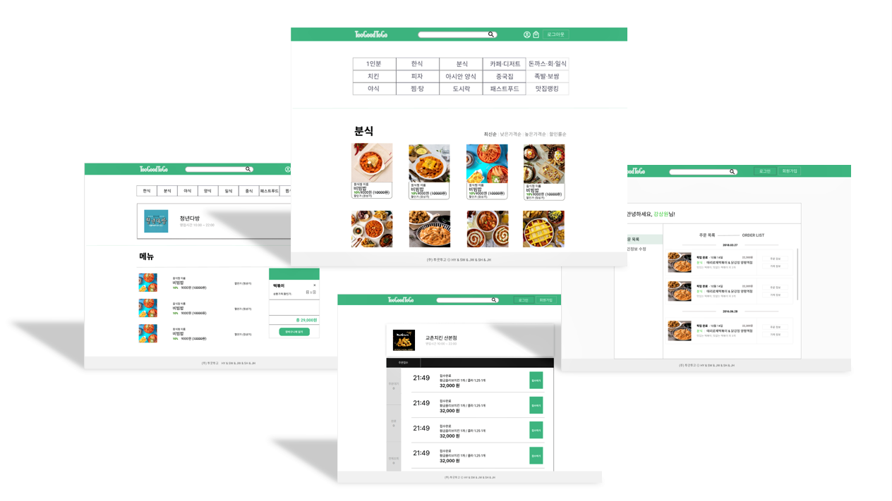

# Too-Good-To-Go Web Project

---
## 아이디어 주제

*  음식물 폐기문제를 해결하기 위해 지역 식당, 빵집, 식료품점의 남은 식품을 정가 대비 저렴하게 소비자에게 판매하는 웹사이트
 

## 프로젝트 방식(타입)

*  Full Stack
 

## 기능 설명

* 메뉴 카테고리, 가게에 따라 상품을 장바구니에 추가하거나 즉시 주문 가능
* 주문할 경우 기존 저장된 사용자 정보를 불러오거나 신규 등록 가능
* 주문자가 주문내역 및 마이페이지를 확인 가능
* 사장님은 가게 및 상품을 등록 가능
* 사장님은 가게별로 접수된 주문에 대해 주문 접수 및 거절
* 주문 접수 등록된 시간에 따라 주문자의 주문내역에 실시간 반영
 

## 기술 설명
- React, TypeScript, Redux 를 이용해 Front-end 개발 
- SpringBoot, JPA, REST API 이용해 Back-end 개발
- Amazon AWS, Docker, GithubActions를 이용해 CI/CD 구축
 

## 기술 스택

### Front
* React

| **항목** | **기술 스택**              |
| -------- | --------------------------- |
| 환경세팅    | CRA |
| 사용언어    | TypeScript |
| 스타일링    | Emotion |
| 상태관리    | Hooks, Redux |
| 코드통합    | Prettier |
| 에러검출    | Eslint |
| API 통신    | Axios |

### Back
* SpringBoot

| **항목** | **기술 스택**              |
| -------- | --------------------------- |
| Server    | AWS |
| DB    | Amazon RDS |
| 문서자동화    | REST Docs |
| 보안    | Spring Security, JWT |
| 기타    | REST API, JPA, QueryDSL |

### CI/CD
* Docker
* Github Actions
* Amazon AWS

### 협업 툴

-  Github
-  Notion
-  Slack
-  줌(Zoom)
-  figma

---

